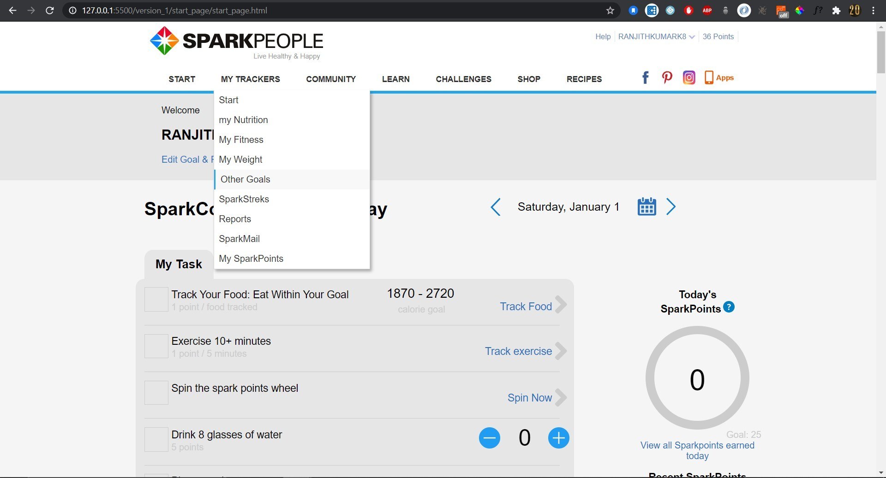
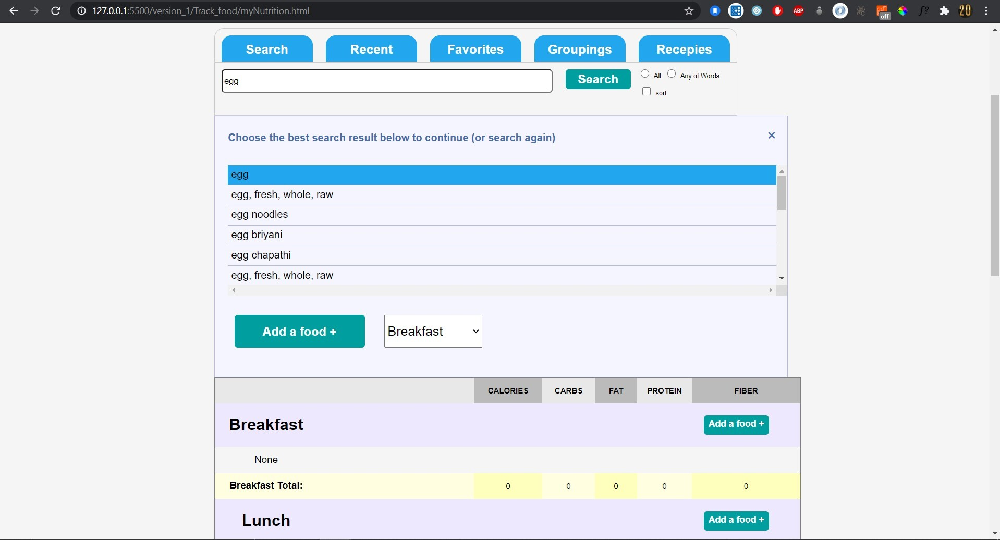

# SparkPeople (Clone)
SparkPeople is a health and fitness company that offers nutrition advice, health-and-fitness tools, a highly engaged and supportive community, and resources that are 100% free.
Far beyond just weight loss, SparkPeople helps everyone learn to eat better and exercise regularly—for life.

In this project we have tried our best to make the exact replica of SparkPeople.With the technology stack that we have learnt in masai school we were able to build the front-end of the SparkPeople app.
### Technology Stack we used in building this Project :
- HTML
- CSS
- JAVASCRIPT

## A Small tour to Our Project...!

#### To get to know about our project, you can go through the following steps: 

1. This is the landing page of the website. When then user opens the website this is the page the user lands to. We have added hover effects in the page to make it appear more of a perfect clone.

2. This is the dashboard where the user can take care of some of the activities like the number of glasses of water he drinks in a particuler day, exercise he does and can also track the food he intakes

3. Here the user can keep a on the nutrition(fats, carbs,proteins etc.,) he/she is taking in for any individual meal by just selecting the food he is taking and the type of meal he is taking it for.

4. In This page the user can set goals like the number of hours of sleep he/she should get for any particular day.

5. Here, in this page the user can check on the tending and popular posts by other users and can also follow others.

6. This is the lifestyle page where user can learn about different lifestyles he/she can follow depending on the interest or requirement.

7. In this page, the user can set challenges and can also invite friends to make health and fitness more fun.

8. This is the shop page, where we can find some of the recommendations to shop for better and easy health and fitness props that are handy in kitchen or apparel.

## Team members and Contributors: 

### Manish Raghavan
- github : [Manish Raghavan](https://github.com/ManishRaghavan)

- linkedin : https://www.linkedin.com/in/manish-raghavan-399a59200/

### Ranjit Kumar Kommuri
- github : [Ranjit Kumar](https://github.com/ranjithkumark8)

- linkedin : https://www.linkedin.com/in/ranjithkumar-kommuri-589010a7/

### Rabia Basari
- github : [Rabia Basari](https://github.com/Rabia7-Masai)
- linkedin : https://www.linkedin.com/in/rabia-basari-467751200/

